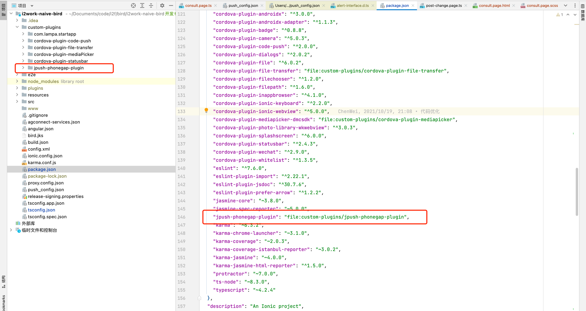
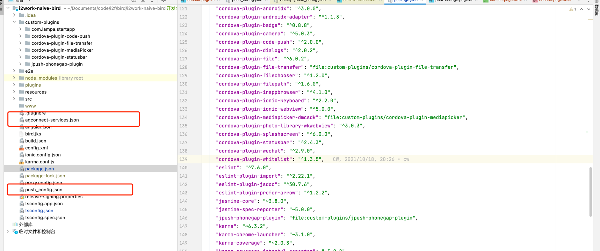

# JPush PhoneGap / Cordova Plugin   厂商通道集成插件
华为小米通道已测试通过，oppo、vivo由于需要将应用上架到市场才能正常使用，故未将代码放在此插件中，若需要，可单独联系
### 使用说明
通过git下载源码后，以本地插件的方式使用

agconnect-services.json为华为厂商通道集成文件，可在华为开放平台获取，需放在项目根目录下

push_config.json为其他厂商通过配置文件，需放在项目根目录

