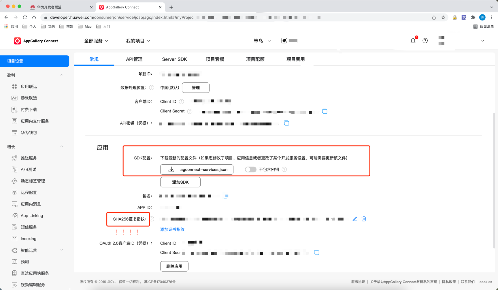

# jpush-phonegap-plugin-vendor-channel
极光推送厂商通道(华为、小米、魅族、oppo、vivo)集成Cordova插件

### 使用步骤及说明
#### 1.获取华为推送配置文件agconnect-services.json

如上图所示，在华为开放平台配置好推送相关信息后即可下载此文件，下载后将此文件放在cordova项目根目录。
需要特别注意的是，华为开放平台配置的是SHA256证书指纹，若配置为了SHA1证书指纹，厂商通道启用将会失败。
#### 2.添加项目推送配置文件push_config.json
push_config.json为除华为外其他厂商(小米等)的推送配置信息，在cordova项目根目录新建**push_config.json**，文件内容如下，并将对应值修改正确
```json
//push_config.json文件内容
{
  "applicationId": "your_android_package_id",
  "JPUSH_APPKEY": "your_jpush_appkey",
  "JPUSH_CHANNEL": "developer-default",
  "MEIZU_APPKEY": "MZ-魅族的APPKEY",
  "MEIZU_APPID": "MZ-魅族的APPID",
  "XIAOMI_APPID": "MI-小米的APPID",
  "XIAOMI_APPKEY": "MI-小米的APPKEY",
  "OPPO_APPKEY": "OP-oppo的APPKEY",
  "OPPO_APPID": "OP-oppo的APPID",
  "OPPO_APPSECRET": "OP-oppo的APPSECRET",
  "VIVO_APPKEY": "vivo的APPKEY",
  "VIVO_APPID": "vivo的APPID"
}
```
#### 3.安装插件
**确保前两步已完成后在执行插件安装！**
前两步完成后项目结构如下图所示：

安装命令：
```
cordova plugin add jpush-phonegap-plugin-vendor-channel --variable APP_KEY=your_jpush_app_key
```
#### 4.打包测试
dev打包和release打包时所用的证书都应该为在厂商开放平台配置过得指纹，若打包证书不一致，厂商通道也会启用失败。
