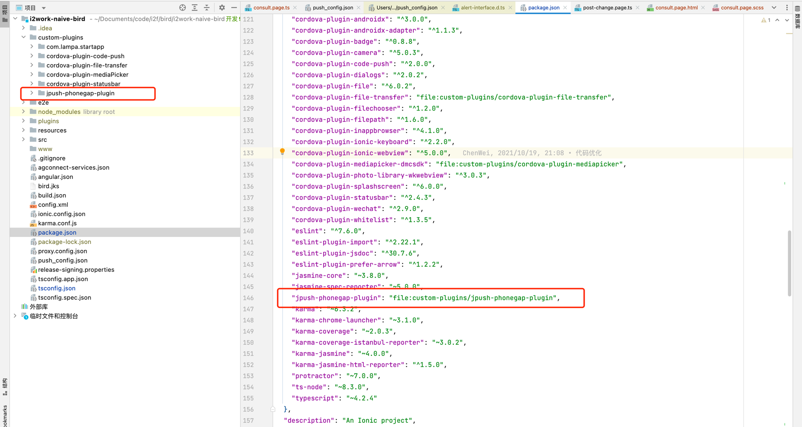
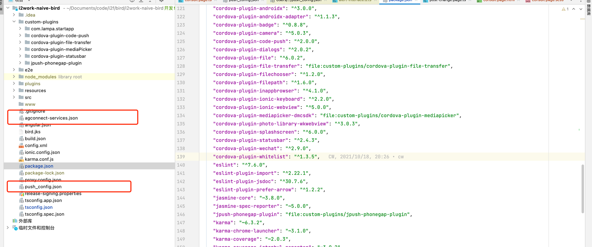

# jpush-phonegap-plugin-vendor-channel
极光推送厂商通道集成Cordova插件

华为、小米通道已测试通过生产使用中，oppo、vivo由于需要将应用上架到市场才能正常使用，故未将代码放在此插件中，若需要，可单独联系
### 使用说明
通过git下载源码后，以本地插件的方式使用

agconnect-services.json为华为厂商通道集成文件，在华为开放平台配置好推送相关信息够即可下载，需放在项目根目录下。

push_config.json为其他厂商通过配置文件，需放在项目根目录

### 注意事项
1. 华为开放平台配置安卓打包证书指纹时与其他平台有一定区别，华为开放平台需要配置的是SHA256证书指纹，其他平台需要配置的是SHA1证书指纹。
2. 若打测试包进行联调测试推送功能时，务必在app的build.gradle中将打包证书调整为在开放平台所配置的证书。
